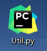
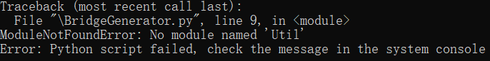
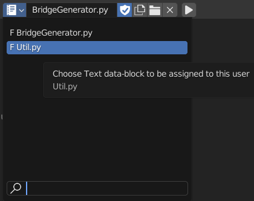

# Import your own module to Blender DEMO

It is very hard to directly use `import` command to import your own module to Blender, since the Blender doesn't support it.

## Here is a demonstration of how to import module.
I have a file named `Util.py`

As usual, I tried `import Util` in `BridgeGenerator.py`.
The system console threw a `ModuleNotFoundError`.

What you gonna do instead, is using
```python
my_module = bpy.data.texts["my_module"].as_module()
```
Before trying to import your own model, you need to make sure you link all the file to the current project, i.e. open all the files.

The file path doesn't really matter as long as they are linked to the same project.
I made the `CrossSection` class in the `Util.py` file, so as an example
```python
Util = bpy.data.texts["Util"].as_module()
cs = Util.CrossSection()
```
It works well.