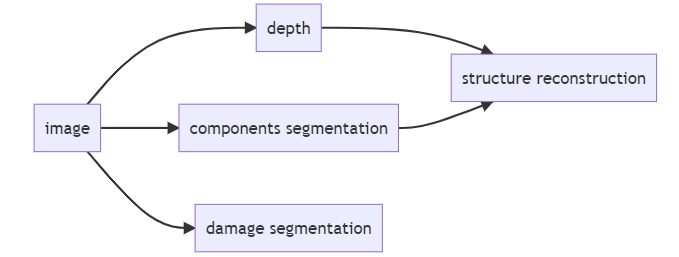
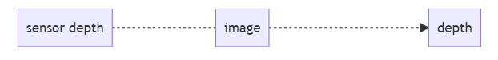
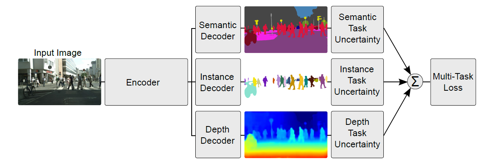
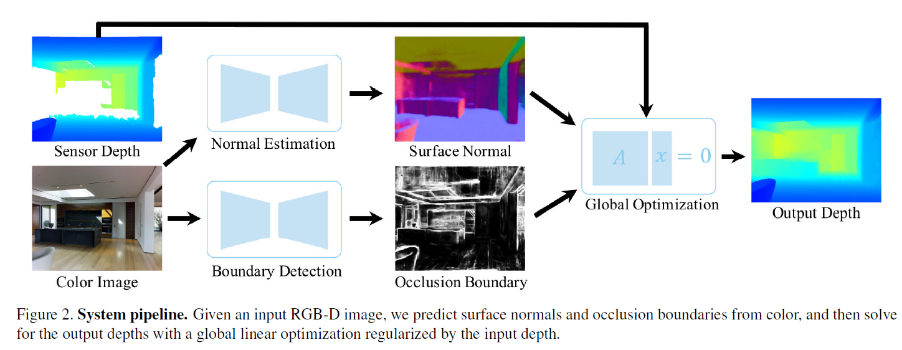

# SRPP 2022 | Synthetic Structural Benchmark
### Speaker: *Wenhao Chai*

---

# GitHub Tutorial

1. Download [Git](https://git-scm.com/downloads)
2. Create a [GitHub](https://github.com/) account
3. Send me your account
4. Type in terminal 
    `$ git config --global user.name "John Doe"`
    `$ git config --global user.email johndoe@example.com`
5. Type in terminal
    `ssh-keygen -t rsa -C "your_email@example.com"`
6. Copy `id_rsa.pub` and add

---

# GitHub Tutorial (Con't)

7. Create a new folder
8. Type in terminal
   `git clone https://github.com/Reself-C/Synthetic-Structural-Benchmark.git`
9. `git pull`
10. `git add .`
11. `git commit -m "message"`
12. `git push`
13. `README.md` and `.gitignore`
14. `GitLens`

---

# Define Tasks

### Synthetic Dataset (Multi-Task)

### Real-world Dataset (Multi-Modal)

---

# Reference

1. An Overview of Multi-Task Learning in Deep Neural Networks
2. Multi-Task Learning Using Uncertainty to Weigh Losses for Scene Geometry and Semantics
3. Deep Depth Completion of a Single RGB-D Image

---

# An Overview of Multi-Task Learning in Deep Neural Networks

## Ruder

---

- Why it works?

  - **implicit data augmentation**
  - **bagging in machine learning** (balance noise)
  - **easy tasks help hard tasks** (2D->3D etc)
  - **inductive bias** (generalization and transfer learning)

---

---

# Multi-Task Learning Using Uncertainty to Weigh Losses for Scene Geometry and Semantics

## Kendall et al.

---

---

# Deep Depth Completion of a Single RGB-D Image

## Zhang et al.

---

---

# Experience Setting

*Tokaido Dataset*

 1237 regular images with close-up damage

*Experiments*

1. single component segmentation baseline
2. single damage segmentaion baseline
3. single depth estimation baseline

---

# Experience Setting

*backbone*

- Unet [[paper](https://arxiv.org/abs/1505.04597)] [[docs](https://smp.readthedocs.io/en/latest/models.html#unet)]
- Unet++ [[paper](https://arxiv.org/pdf/1807.10165.pdf)] [[docs](https://smp.readthedocs.io/en/latest/models.html#id2)]
- MAnet [[paper](https://ieeexplore.ieee.org/abstract/document/9201310)] [[docs](https://smp.readthedocs.io/en/latest/models.html#manet)]
- Linknet [[paper](https://arxiv.org/abs/1707.03718)] [[docs](https://smp.readthedocs.io/en/latest/models.html#linknet)]
- FPN [[paper](http://presentations.cocodataset.org/COCO17-Stuff-FAIR.pdf)] [[docs](https://smp.readthedocs.io/en/latest/models.html#fpn)]
- PSPNet [[paper](https://arxiv.org/abs/1612.01105)] [[docs](https://smp.readthedocs.io/en/latest/models.html#pspnet)]
- PAN [[paper](https://arxiv.org/abs/1805.10180)] [[docs](https://smp.readthedocs.io/en/latest/models.html#pan)]
- DeepLabV3 [[paper](https://arxiv.org/abs/1706.05587)] [[docs](https://smp.readthedocs.io/en/latest/models.html#deeplabv3)]
- DeepLabV3+ [[paper](https://arxiv.org/abs/1802.02611)] [[docs](https://smp.readthedocs.io/en/latest/models.html#id9)]