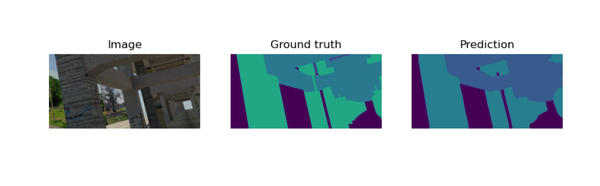

# SRPP 2022 | Synthetic Structural Benchmark
### Speaker: *Wenhao Chai*

---

# Experience Results

---
# Componenets Segmentation (Con't in notebook)

Arch: *UNet*
Backbone: *Resnet50*
mIOU: **86.9**

**90.5** Nonbridge
**39.3** Slab
**55.0** Beam
**90.8** Column
**58.7** Nonstructural components (Poles, Cables,  Fences)
**20.9** Rail
**90.3** Sleeper
**79.1** Other components

---

# What We Have?

**Architectures**
Unet / Unet++ / MAnet / Linknet / FPN / PSPNet / PAN / DeepLabV3 / DeepLabV3+

**Backbone**
ResNet / ResNeXt / ResNeSt / Res2Ne(X)t / RegNet(x/y) / GERNet /SE-Net / SK-ResNe(X)t / DenseNet / Inception / EfficientNet / MobileNet / DPN / VGG

**Framework**
Complete process, Standardized code

*TODO* more flexible, expandable

---

# Multi-Task Learning Using Uncertianty to Weigh Losses for Scene Geometry and Semantics