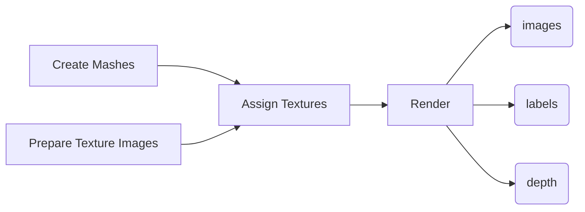
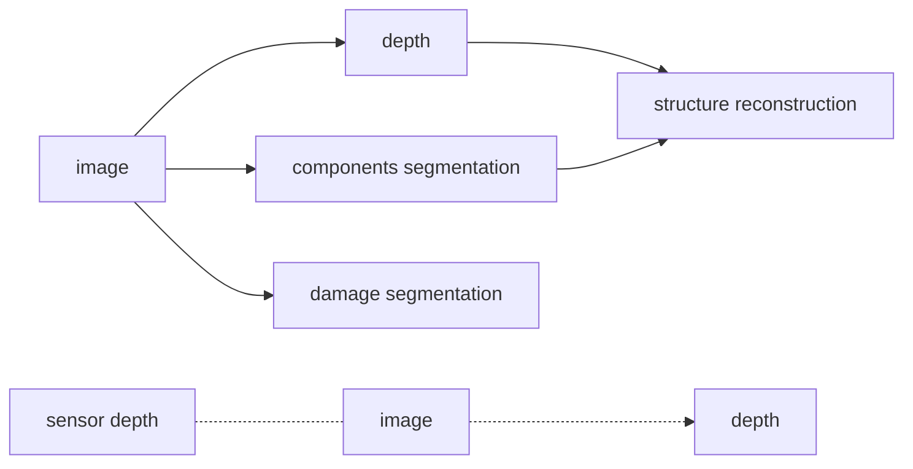

```mermaid
graph LR
step1[Create Mashes]
step2[Prepare Texture Images]
step3[Assign Textures]
step4[Render]
output1(images)
output2(labels)
output3(depth)
step1-->step3
step2-->step3
step3-->step4
step4-->output1
step4-->output2
step4-->output3
```

```mermaid
graph LR
RGB[image]
D[depth]
SD[sensor depth]
seg[components segmentation]
dam[damage segmentation]
rec[structure reconstruction]
RGB-->D
RGB-->seg
RGB-->dam
D-->rec
seg-->rec
SD-.-image-.->depth
```