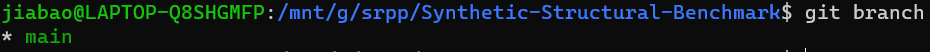
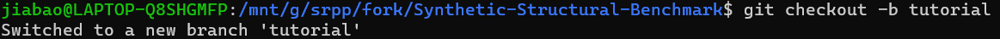
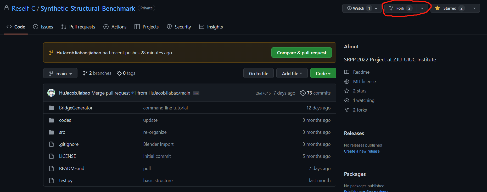
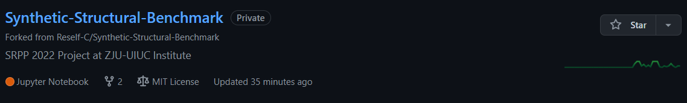
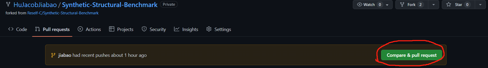
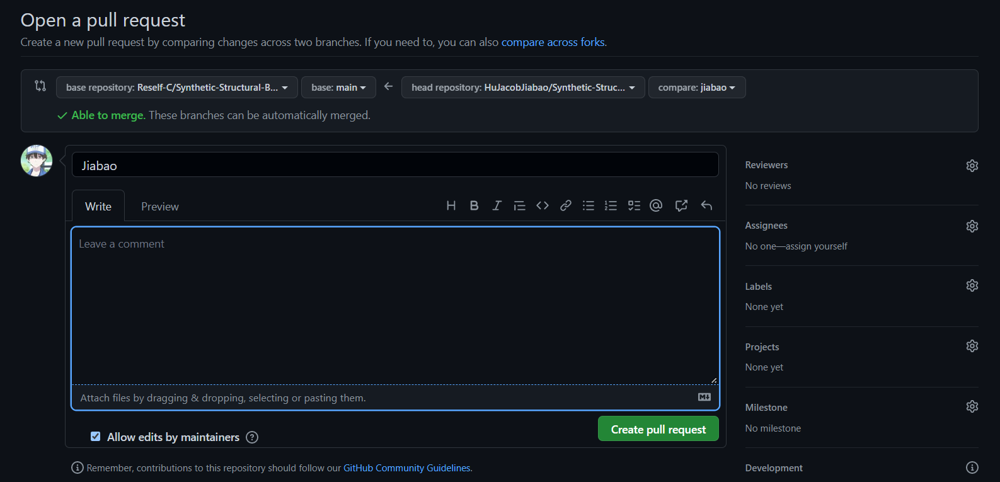
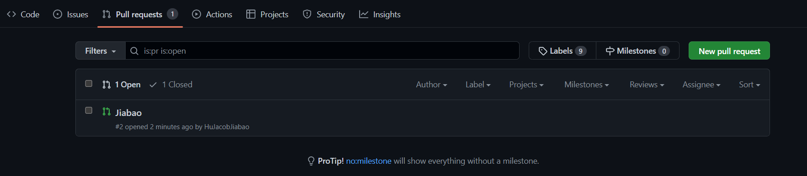

# Manage Your Own Files
## 1. Developing in new branches
Before you do everything in the project, there's only one branch called main.
```bash
git branch
```

If we want to create new branches, using the command
```bash
git checkout -b xxx
```
The content in xxx is the name of the new branch. And then you will automatically go to the new branch.

Now using ``git branch`` to check the branch list, you will see the new branch in your terminal.
After `add`, `commit`, using
```bash
git push --set-upstream origin xxx
```
to push your current branch to an upstream branch.

After you push it successfully, using command
```bash
git pull origin xxx
git push origin xxx
```
to manage your files in your own branch.

If you think you need to merge your code to the `main` branch, notify me and I will review your codes and then merge them.
## 2. Fork the project
You can find the "fork" button on the upper-right corner of the project repo website.


Click the button, then you will create a new repo under **YOUR** account. 


If you think your codes can be merged to the original project. 
Click the `Compare & pull request` button

Leave your comment, and create pull request.


Finally, you will see there's one new pull request in the original project repo.

I will review all of the commit and merge it to the original repo.