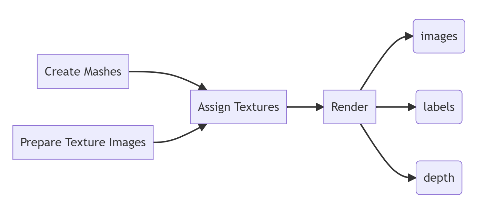
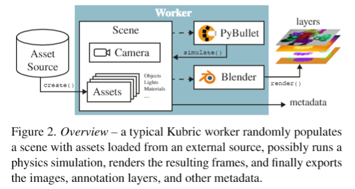
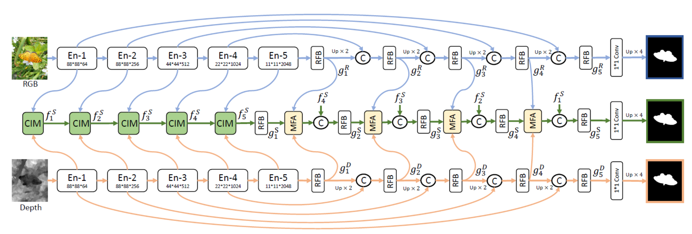

# SRPP 2022 | Synthetic Structural Benchmark
### Speaker: *Wenhao Chai*

---

# Synthetic Environments for Vision-based Structural Condition
## Yasutaka Narazaki et al.

---

Overview

---

- Tools: [Blender](https://www.youtube.com/watch?v=nIoXOplUvAw); [Blender-Python API](https://www.youtube.com/watch?v=XqX5wh4YeRw)
- based some basic rules
- random parameters
- Another possible choice?

---

# Kubric: A scalable dataset generator
## Google

https://github.com/google-research/kubric

---

# What can we do with the synthetic dataset?

- components semantic segmentation
- damage recognition
- structural localization and reconstruction

---

# How to do?

- multimodal input
- multitask output

---

### Some RGB-D Works in *CVPR2021 ICCV2021 ECCV2020*

1. **Specificity-preserving RGB-D Saliency Detection**
2. Cross-Modal Weighting Network for RGB-D Salient Object Detection
3. Accurate RGB-D Salient Object Detection via Collaborative Learning
4. BBS-Net: RGB-D Salient Object Detection with a Bifurcated Backbone Strategy Network
5. Cascade Graph Neural Networks for RGB-D Salient Object Detection
6. Hierarchical Dynamic Filtering Network for RGB-D Salient Object Detection
7. A Single Stream Network for Robust and Real-time RGB-D Salient Object Detection
8. RGB-D Salient Object Detection with Cross-Modality Modulation and Selection
9.  Progressively Guided Alternate Refinement Network for RGB-D Salient Object Detection

---

