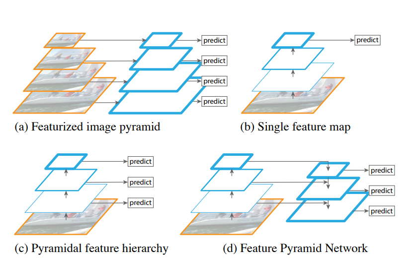

# SRPP 2022 | Synthetic Structural Benchmark
### Speaker: *Wenhao Chai*

---

# Experience Design

*Tokaido Dataset*

 1237 regular images with close-up damage

*Experiments*

1. single component segmentation baseline
2. single damage segmentaion baseline

---

# Backbone | FPN

---

# Experience Setting

size = (640, 320)
no_augmentation
batch_size = 8
learning_rate = 1e-4
epochs = 10
encoder = ResNet18 / ResNet50 / ResNet101

---

|backbone|miou|
|---|---|
|resnet18|0.579|
|resnet50|0.617|
|resnet101|0.699|

---

## TODO

- depth estimation
- multi-task