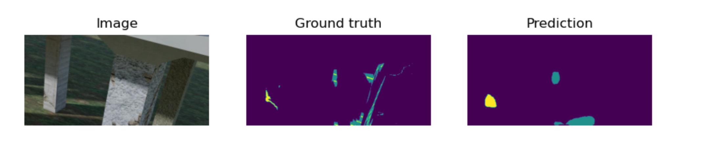

# SRPP 2022 | Synthetic Structural Benchmark
### Speaker: *Wenhao Chai*

---

# Damage Segmentation

|Type|IoU|
|---|---|
|No Damage|-|
|Concrete Damage (cracks, spalling)| 0.666|
|Exposed Rebar|0.543|

---

# Ensemble Learning

### data-based

### model-based

---
## Data-level

- Boosting: sequential, itertively update the sample weights
- Bagging: parallel, split the trainset, average the output

---

## Model-level

- Majority Vote: less correlation will be better
- Average: avoid overfitting
- Weighted sum: trust expert, learnable weight

---

Baseline: FPN Resnet50

Majority Vote:  FPN{Resnet18, Resnet50} Unet{Resnet18, Resnet50}

|Type|IoU|IoU(MV)|
|---|---|---|
|No Damage|-|-|
|Concrete Damage (cracks, spalling)| 0.543 |0.666|
|Exposed Rebar|0.479|0.543|

---

# Depth Estimation Con't

Assume $p_i$ is the prediction depth, $g_i$ is the ground truth depth for pixel $i$

Default loss for regression MSE:
$$
  L_{MSE}= \frac{1}{N} \sum_i^N ||p_i-g_i||_2
$$

Equal emphasis on close-up and long-range views (even more on long-range)

---

New loss design

$$
  L_{INV}= \frac{1}{N} \sum_i^N ||\frac{1}{p_i}-\frac{1}{g_i}||_{1\ or\ 2}
$$

focus more on close-up (structure! not sky)