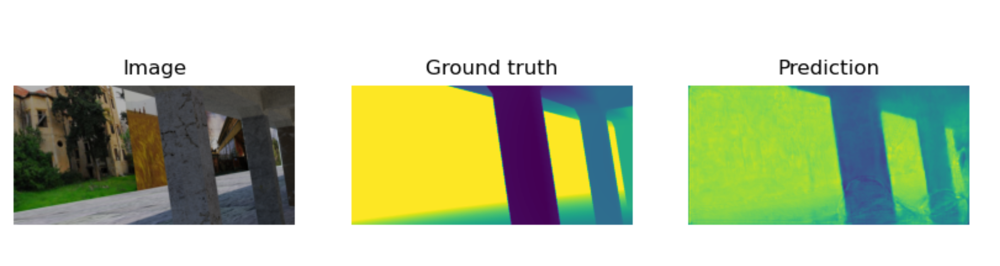
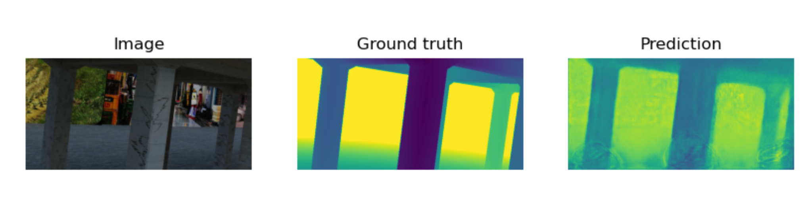
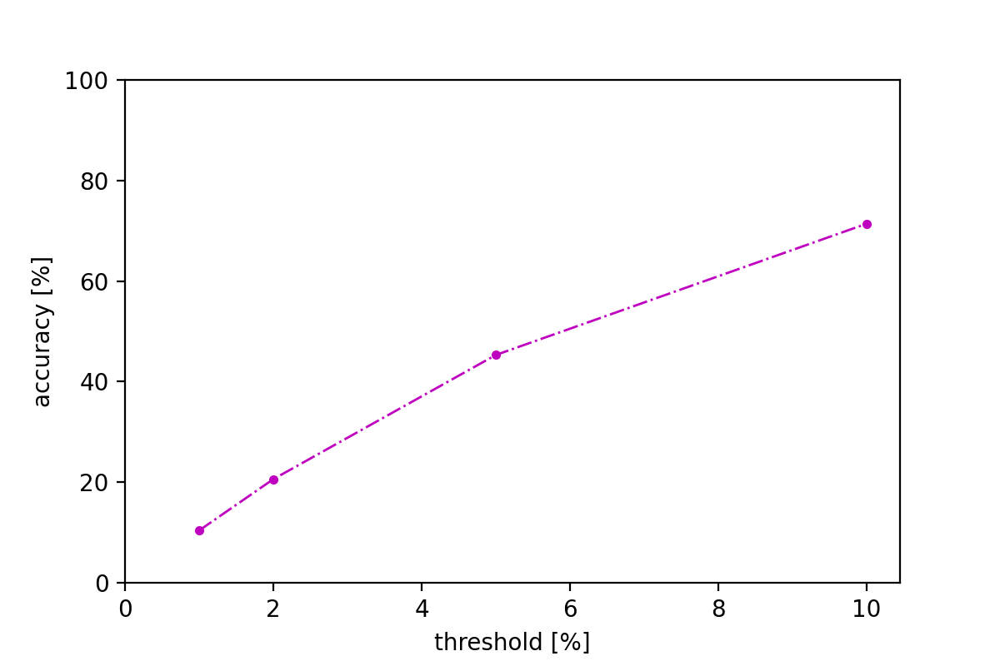

# SRPP 2022 | Synthetic Structural Benchmark
### Speaker: *Wenhao Chai*

---

# Depth Estimation

## Done!

---

### Qualitive Results

---

### Quantitative Results

#### Definition

$$
  error = \frac{|d^* - d|}{d} \times 100 \%
$$

$$
  Acc \% = \frac{N_{error<threshold}}{N_{total}}
$$

---

